# 添加游戏

软件提供四种方式添加游戏。前两种需要配合 `source_url.txt` 文件（内容为游戏对应的帖子链接），第三种是直接添加本地文件夹（信息较少），第四种是从 DLsite / Steam 云端刮削导入。

## 方式一：内置解析器站点下载的游戏

支持站点：**ACG嘤嘤怪、飞雪ACG、维咔ACG**。

1. 在游戏目录下新建一个文本文件，命名为 `source_url.txt`

2. 在文件中填入该游戏对应的帖子链接，例如：

   ```
   https://www.vikacg.cc/p/567658
   ```

   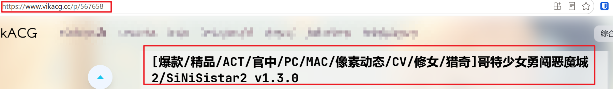

3. 将 `source_url.txt` 放在游戏启动文件（.exe）的**同级目录**下：

   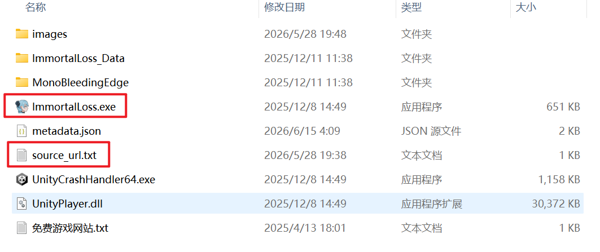

4. 回到软件，进入「刮削」页面 → 扫描游戏库 → 刮削元数据即可正常入库

## 方式二：其他 ACG 站点（自定义解析器）

除了内置站点外，你也可以添加其他 ACG 站点的游戏，但需要先配置自定义解析器。

**准备工作：**

1. 在游戏目录下同样创建 `source_url.txt`
2. 在软件内点击「设置」→「自定义解析器」→「添加站点」，弹出页面如下：

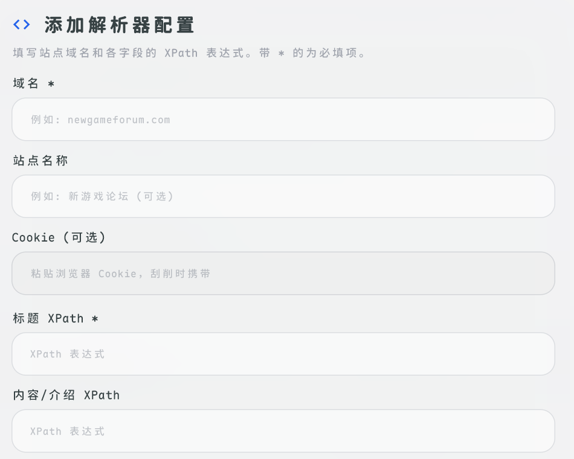

### Step 1 - 填写域名

打开帖子页面，复制浏览器地址栏中 `http://` 后面的域名部分（如 `acgcu.com`），粘贴到自定义解析器的「域名」栏。

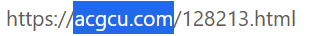

### Step 2 - 获取 Cookie

在帖子页面按 <kbd>F12</kbd> 打开开发者工具 → 点击「网络」→ 点击「文档」（或者是 document）→ 刷新页面。在请求列表中点击任意一条请求，复制其 Cookie 值，粘贴到软件的 Cookie 栏。

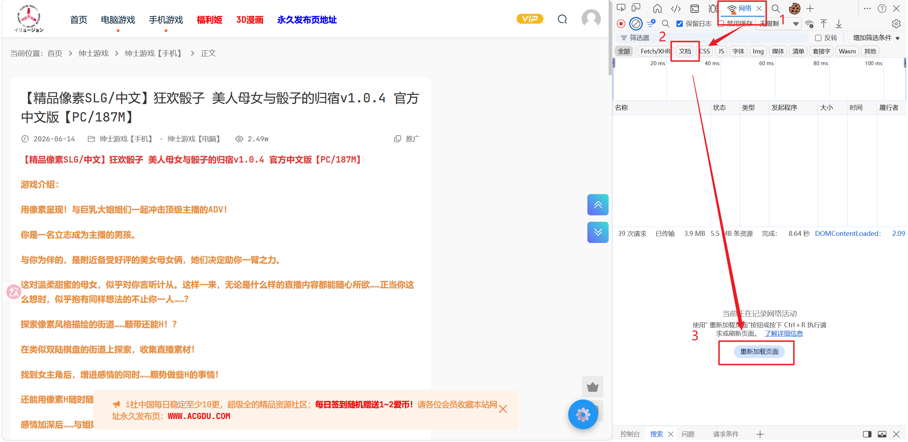

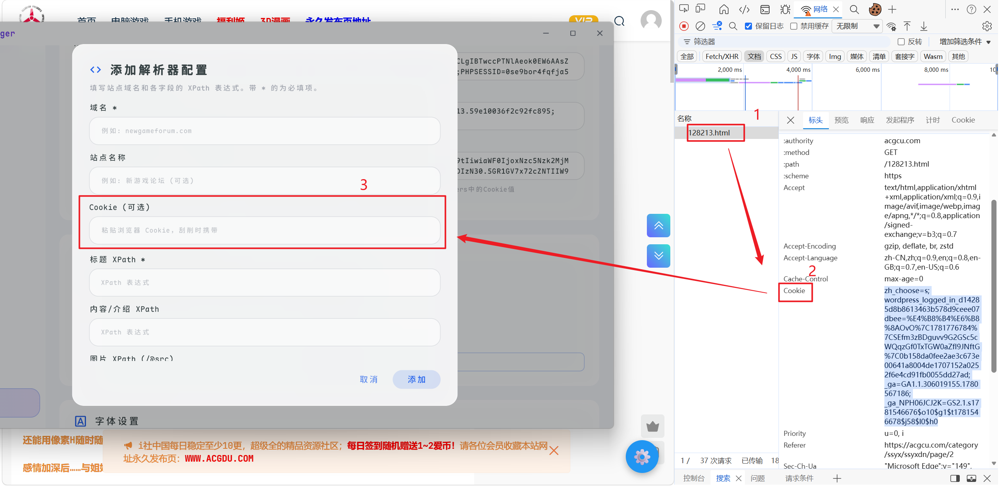

### Step 3 - 获取标题 XPath

点击开发者工具左上角的「选择元素」按钮，然后点击帖子标题。在右侧代码区域找到高亮（灰色）的那段代码，右键 → 复制 → 复制完整 XPath，粘贴到「标题 XPath」栏。

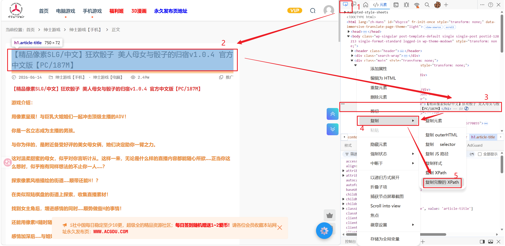

### Step 4 - 获取介绍 XPath

用同样方式选中游戏介绍内容（注意蓝色框要覆盖全部介绍文字，而非仅一小段），右键灰色代码 → 复制 → 复制完整 XPath，粘贴到「内容/介绍 XPath」栏。

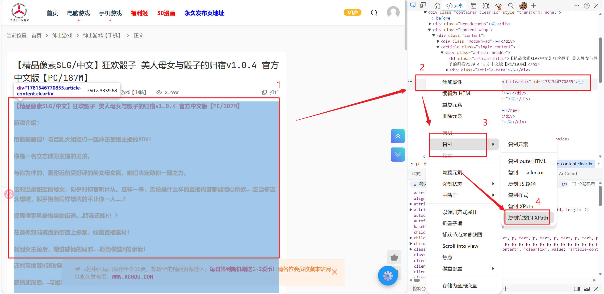

### Step 5 - 保存

填写完成后保存即可。同一站点只需配置一次，后续无需重复添加。

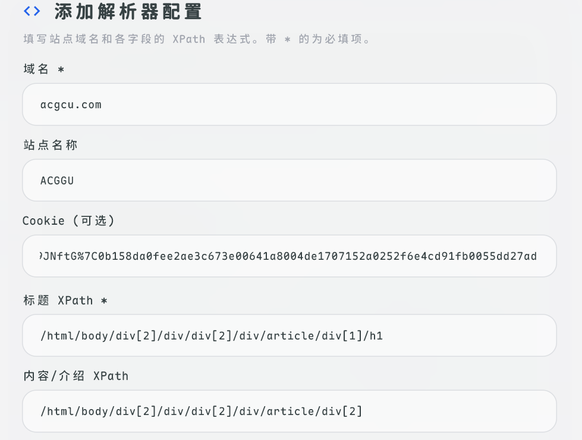

::: tip
配置好自定义解析器后，回到刮削中心即可正常刮削该站点的游戏信息。
:::

## 方式三：直接添加本地游戏

如果不想配置以上内容，或者自定义解析器无法使用，可以直接添加本地文件夹。

1. 进入软件的「游戏」页面
2. 点击右上角的「+」按钮
3. 浏览并选择游戏所在的文件夹，点击确认

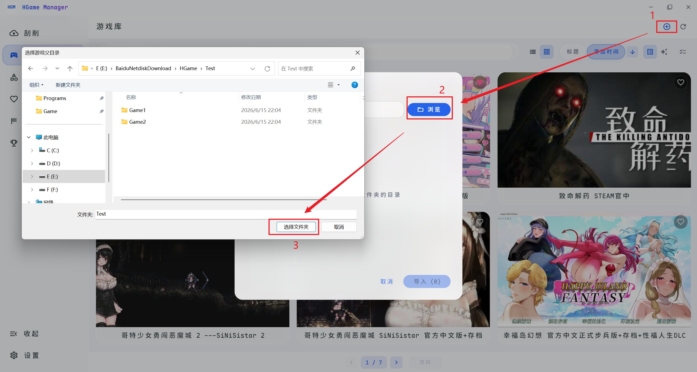

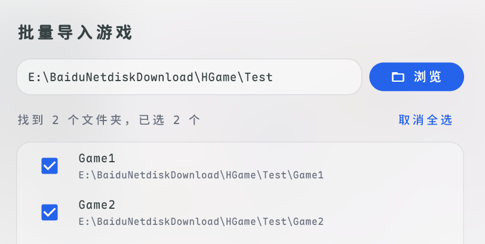

::: warning 注意
软件会将所选文件夹下的**每个子文件夹视为一个游戏**。例如 Test 文件夹下有 Game1、Game2 两个子文件夹，需要选择 Test 文件夹才能同时添加这两个游戏。
:::

### 优化显示

导入本地游戏后，在游戏详情页点击右上角「管理图片」可以导入本地图片或网络图片：

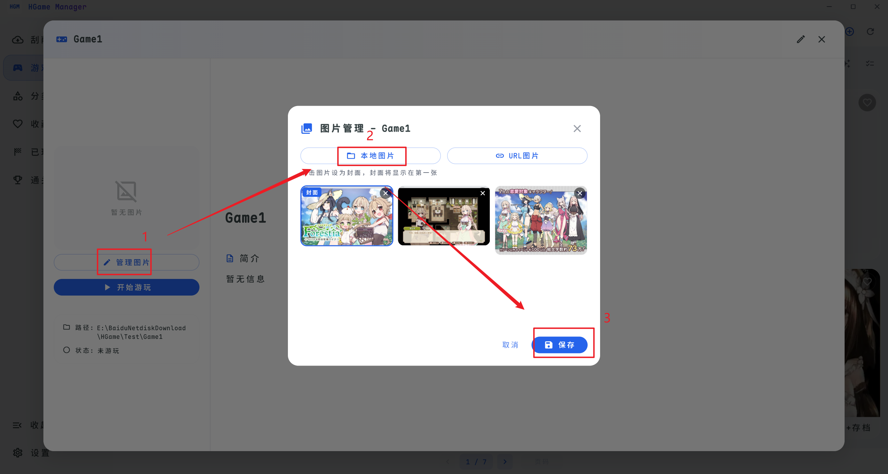

随后可以自己「编辑」信息，简介内部也能「插入」你所添加的图片：

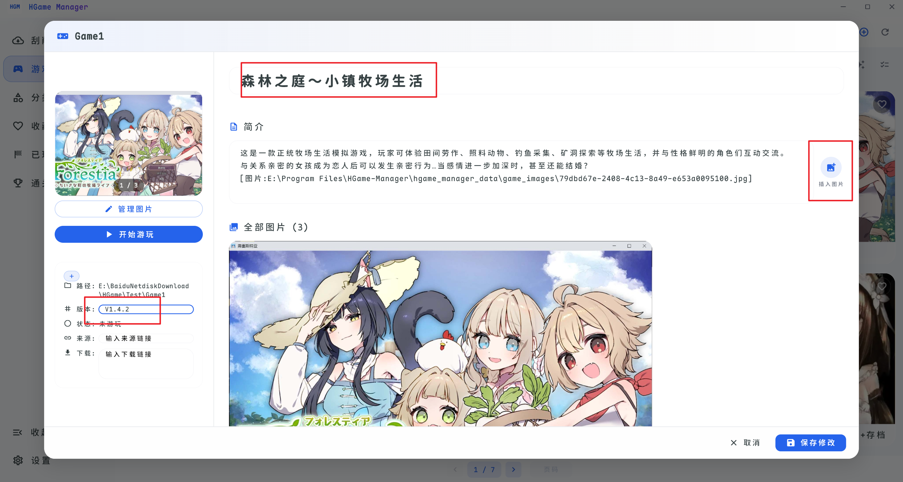

效果展示：

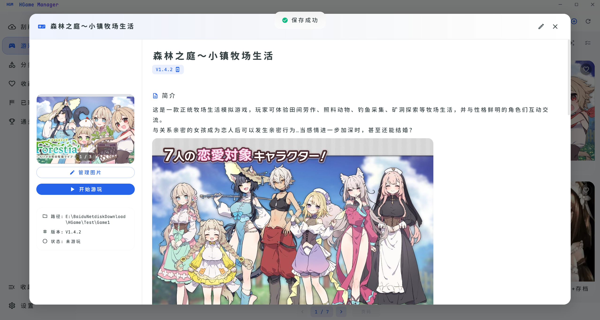

### 快速导入技巧

导入本地游戏后，在游戏详情页点击右上角「编辑」可以修改来源链接。如果填入的链接域名匹配自定义解析器或内置站点，回到刮削中心即可重新刮削。这样可以跳过手动创建 `source_url.txt` 的步骤。

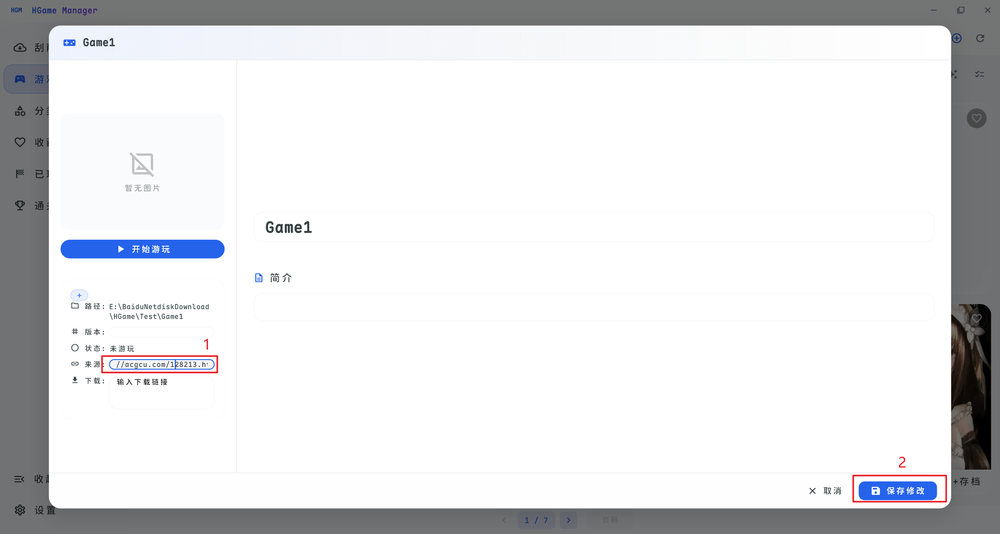

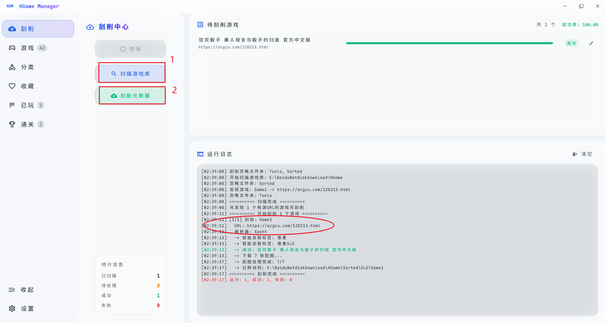

## 方式四：导入本地游戏并从 DLsite 刮削信息

1. 切换到「游戏」页面
2. 点击右上角的「云朵」按钮
3. 选择游戏文件夹
4. 搜索（如果你知道 ID 可以自己输入）
5. 选中游戏
6. 导入选中

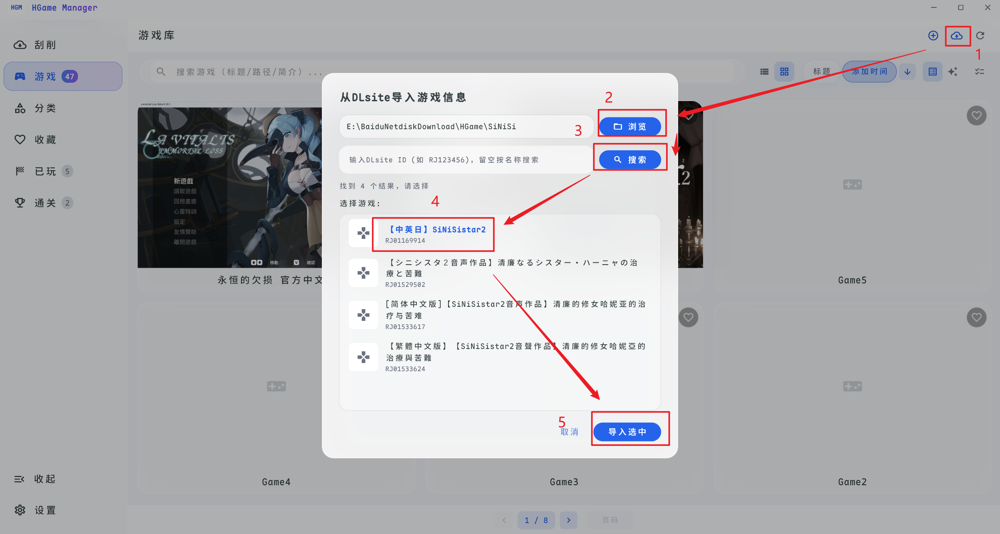

## 方式五：导入本地游戏并从 Steam 刮削信息

- 从 Steam 找到游戏位置（找到游戏右键 → 管理 → 浏览本地文件）

  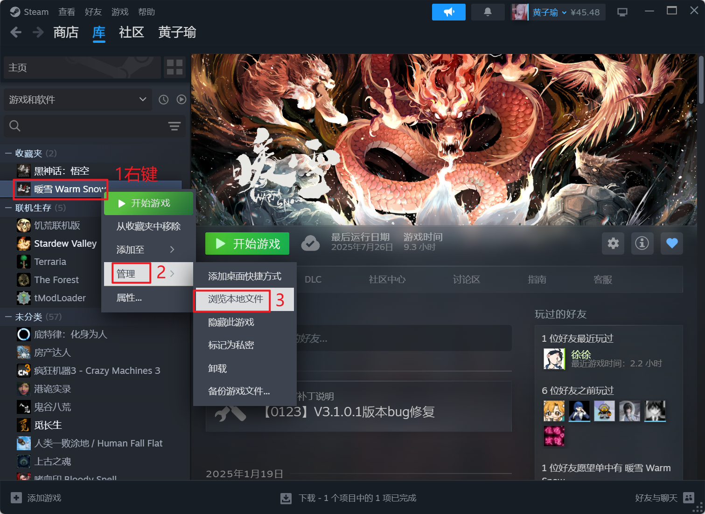

- 选中地址栏复制

  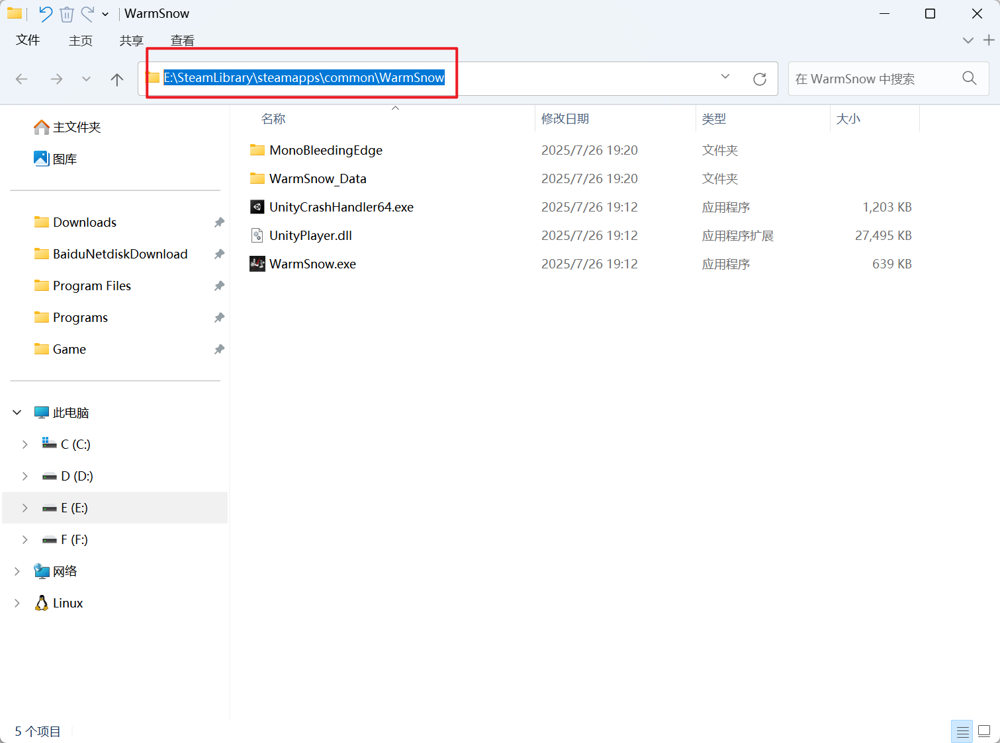

- 回到软件点击右上角的「云朵」按钮，切换到 Steam 选项
- 复制地址选择游戏文件夹
- 搜索 → 选中游戏 → 导入选中

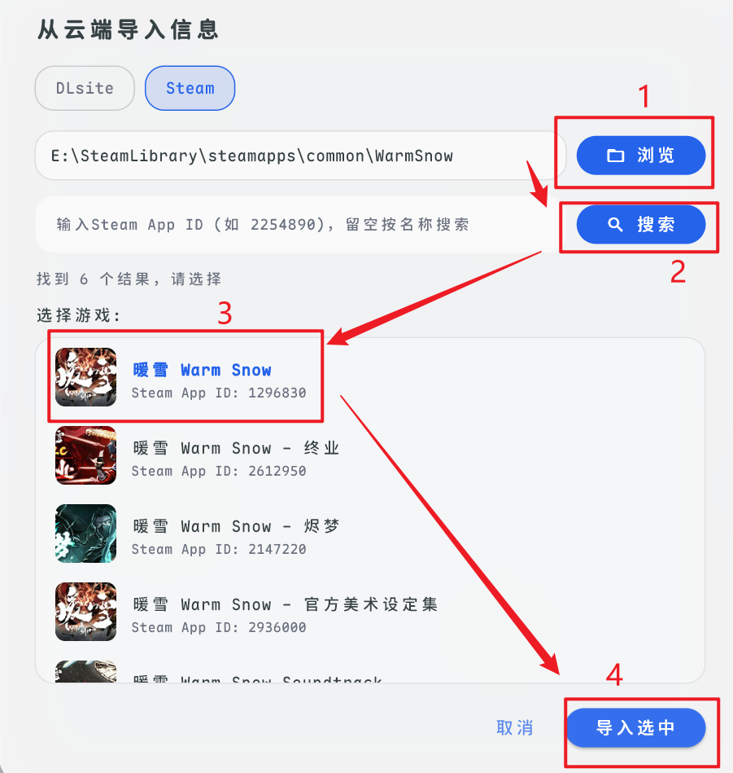
