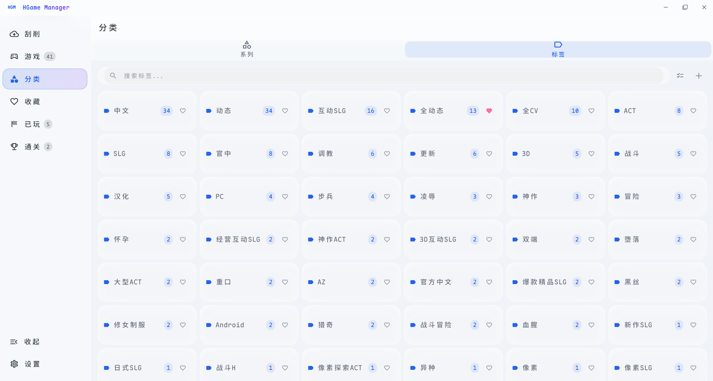
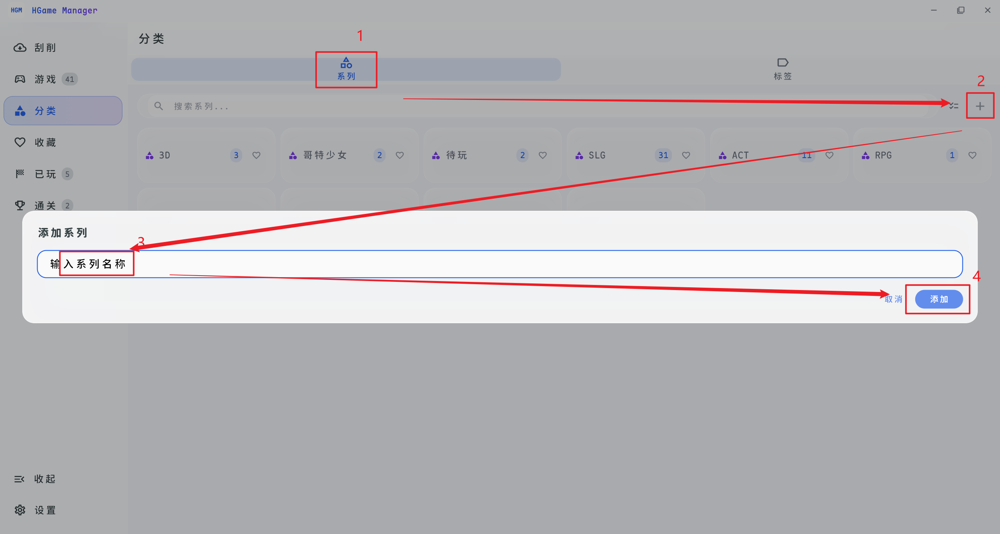
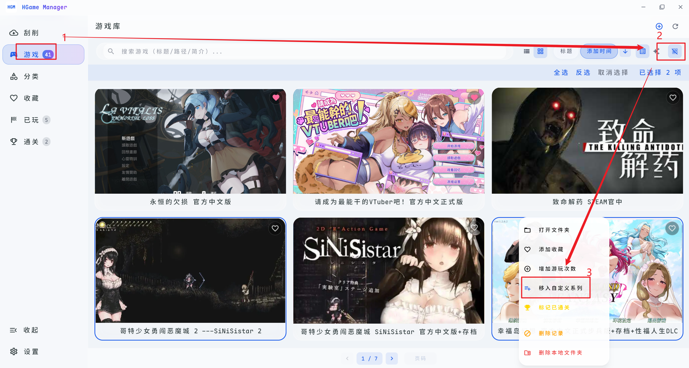
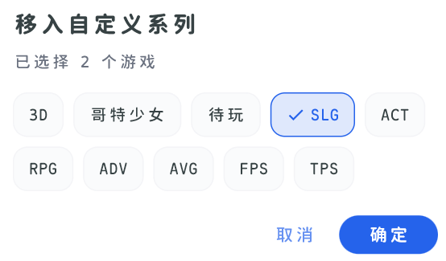

# 分类管理

软件在刮削时会自动生成标签，但自动标签不一定符合你的需求。你可以通过「系列」功能自定义分类。

## 创建自定义系列

1. 切换到「系列」
2. 点击右上角的「+」按钮

::: tip
添加标签或系列时支持连续输入：输入名称后按回车即可继续添加下一个，也可以用逗号一次分隔多个名称。
:::

## 排序方式

页面右上角可切换「按数量 / 自定义」排序：

- **按数量**：默认方式，游戏数量多的标签 / 系列排在前面
- **自定义**：直接拖拽卡片到目标位置即可调整顺序，其它卡片会自动让位，顺序会被记住

在「按数量」模式下拖拽卡片会自动切换为自定义排序。

## 将游戏移入系列

1. 回到「游戏」页面
2. 勾选想要归类的游戏
3. 右键点击游戏 → 选择「移入自定义系列」
4. 在弹窗中选择目标系列，点击确定

