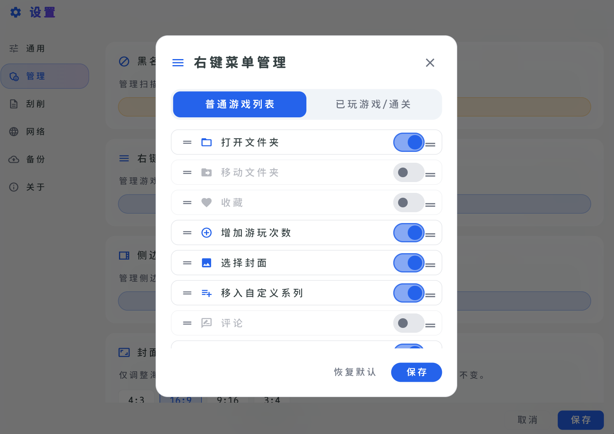
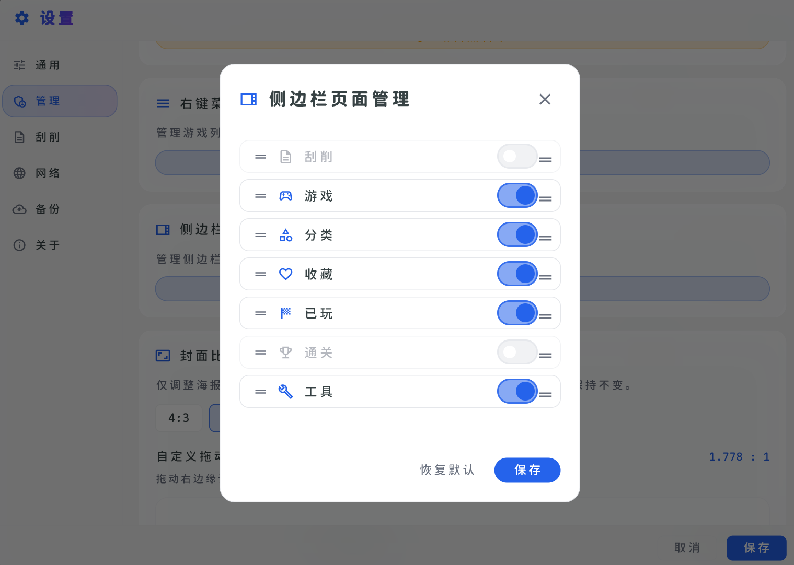
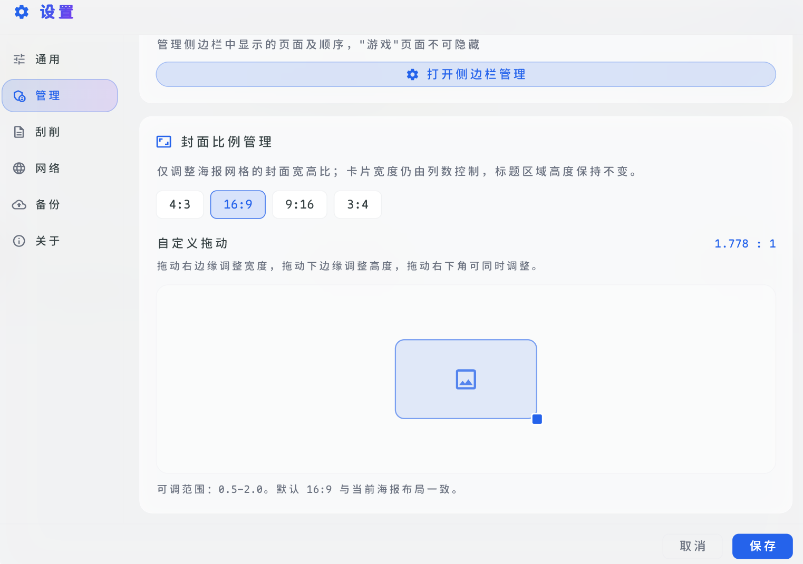
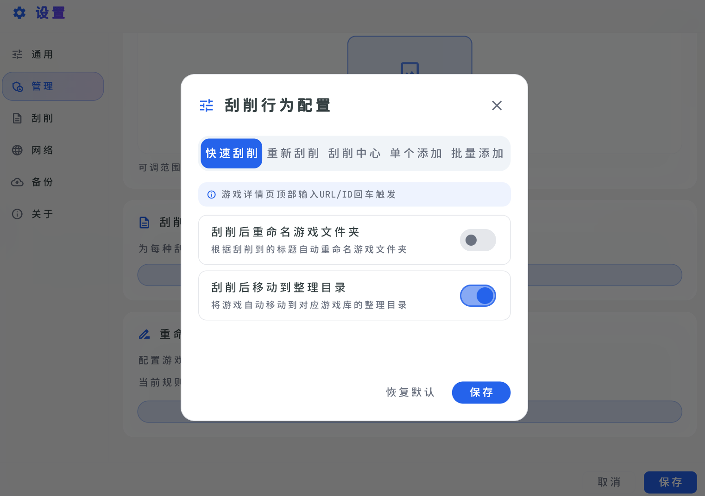
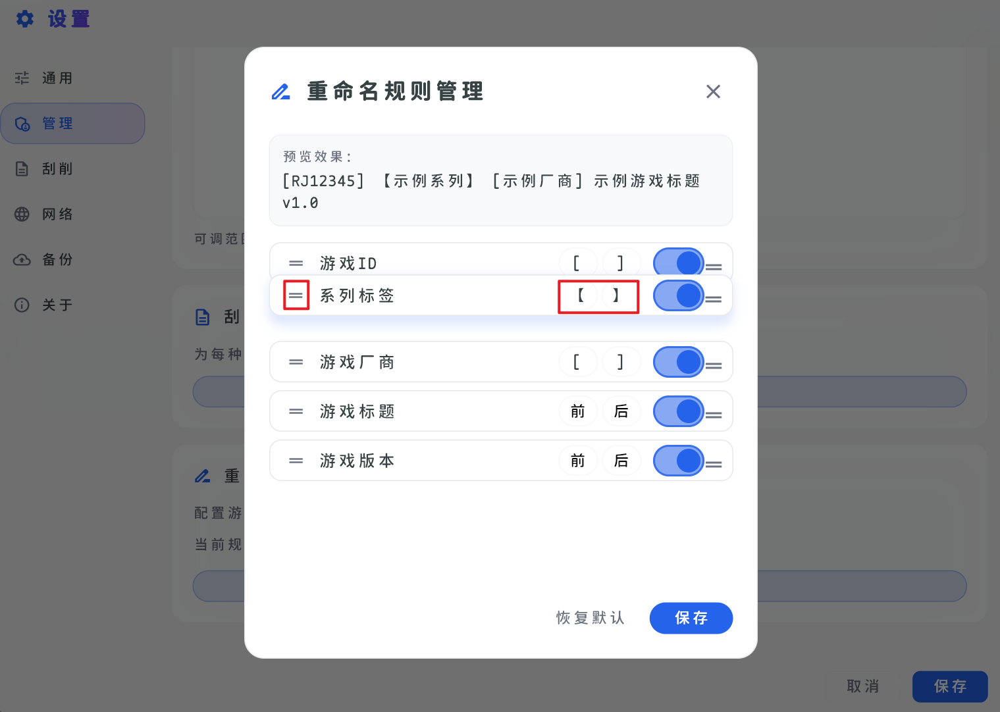

# 自定义管理

由于软件为了方便集成了各种功能，而如果你觉得某些功能并不需要，可以在 `设置` 页面的 `管理` 选项卡进行自定义，这里提供了各种能够进行自定义的设置。

## 右键菜单管理

此处主要针对游戏的右键菜单进行自定义，可以自行进行开关功能，而对于不同的游戏类型进行分开管理。

## 侧边栏管理

此处主要针对侧边栏进行自定义，可以自行修改侧边栏需要展示的选项卡。

## 封面比例管理

此处主要针对封面比例进行自定义，可以通过预览框进行拖拽调整封面展示效果。

## 刮削行为配置

由于软件内置了多种刮削行为，而对于不同的刮削方式在页面上会进行提示，你可以自行设置是否需要刮削后移动游戏到整理目录和是否重命名。

## 重命名规则管理

软件支持对于刮削后的游戏进行重命名，此时会根据刮削到的信息进行重命名文件夹，而你可以设置是否需要启用某些参数和自定义顺序（拖拽即可）以及前后缀，在预览框会实时显示重命名后的文件夹名称。

