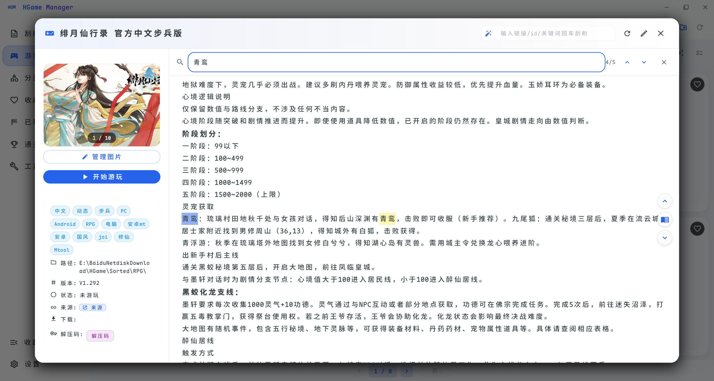
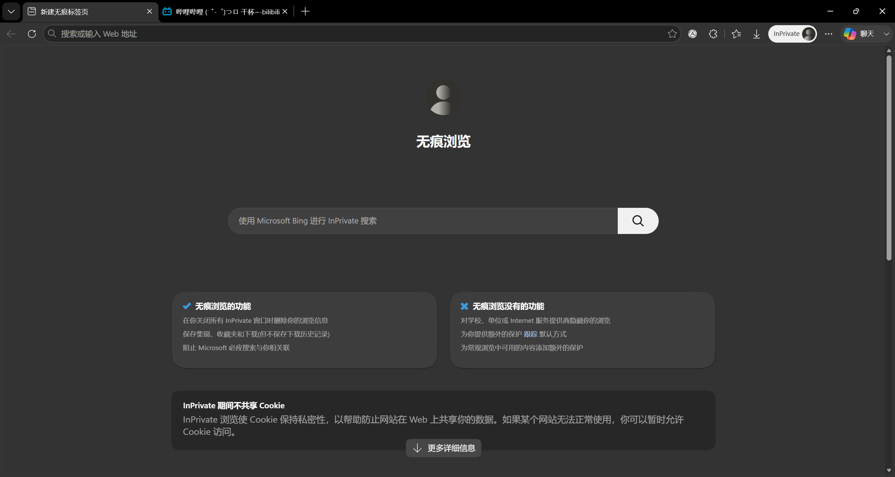
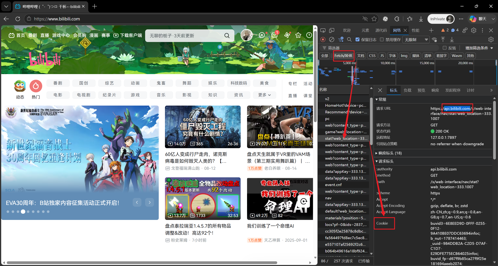

# 攻略管理

软件支持在 `游戏详情页` 设置攻略，支持手动填写和自动搜索导入（2DFan/bilibili），并自动记忆上次浏览位置，可以通过 `Ctrl + F` 进行搜索跳转

## 导入攻略

由于手动填写攻略和2DFan导入较为简单，不做教学，接下来仅教学如何通过bilibili进行搜索

1. 打开浏览器的**无痕模式**（**必须，否则cookie过期很快**）并打开bilibili网页登录自己的账号

    

2. 按 `F12` 打开开发者工具，刷新网页
3. 点击「网络(network)」，然后点击「文档(document)」，找到 `api.bilibili.com` 域名的请求，复制其中的cookie

    

4. 找到软件内的「设置」页面的「刮削」选项，将刚才的cookie填入「pilipili」栏，并点击「保存」

此时回到「游戏详情页」，点击右侧的「攻略」按钮，选择「pilipili」搜索关键词并点击，软件会自动导入攻略