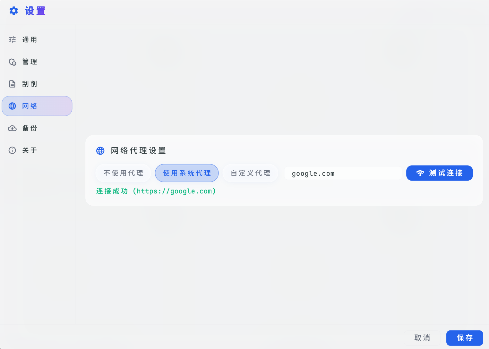
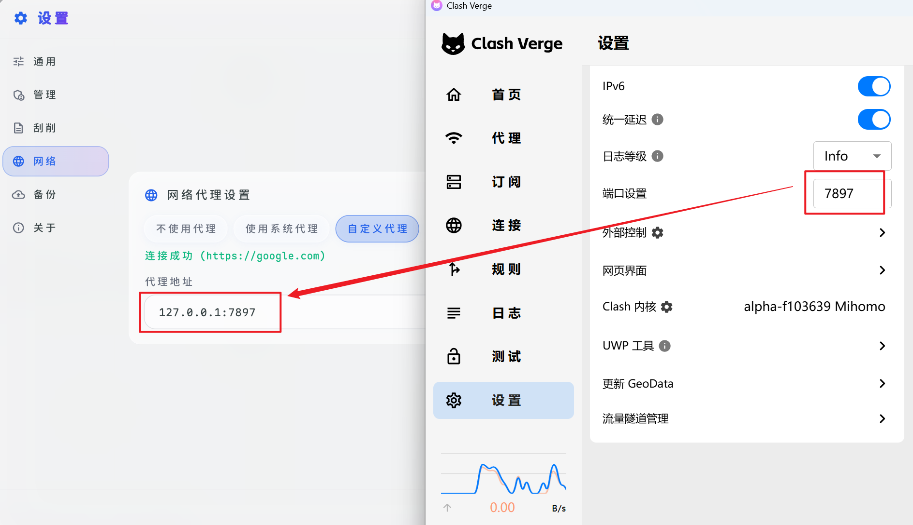

# 网络代理

在刮削的过程中，可能会遇到无法连通对应网站而导致刮削失败的情况，事实上你可能已有**科学上网**，但软件并不会默认直接使用你的代理设置，所以此时需要在「设置」 -> 「网络」中设置代理

## 使用系统代理

一般来说大部分**科学上网**软件都可以直接通过这种方式使用其所设置的系统代理，设置后可以直接利用Google来进行测试是否生效

## 自定义代理

如果你使用的是其余的代理方式（比如通过服务商给出的非本机地址的HTTP代理）或上述方式无法成功，那么此时还可以手动填写自定义代理，按照： `IP:端口号` 的形式填写，如果是服务商给出的HTTP代理直接按此格式填写，例 `125.88.211.13:45389` （不可用，仅为示例）；如果是本地软件例如我这里用的的 [Clash Verge Rev](https://github.com/clash-verge-rev/clash-verge-rev) 在软件设置里可以修改端口，然后将其按照格式填写，即 `127.0.0.1:7897`

