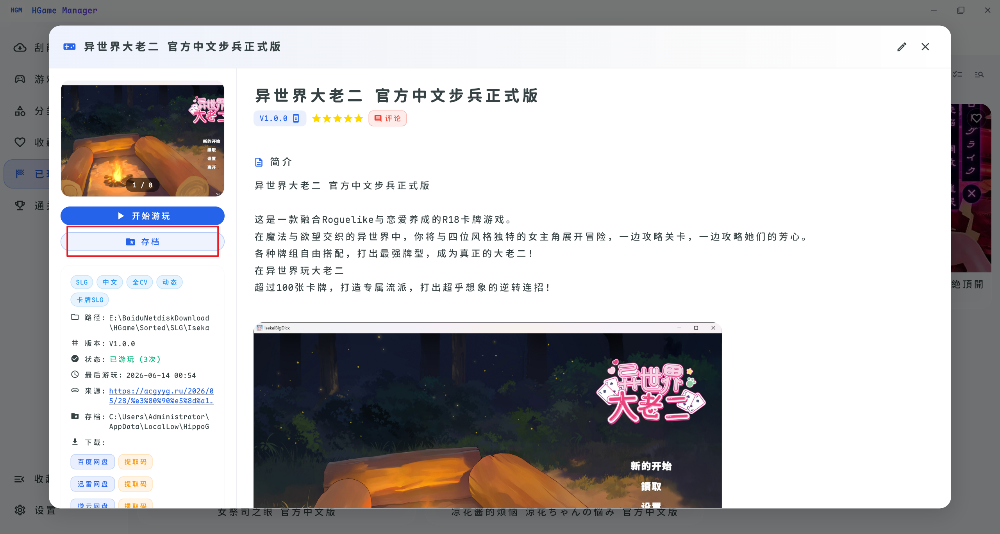
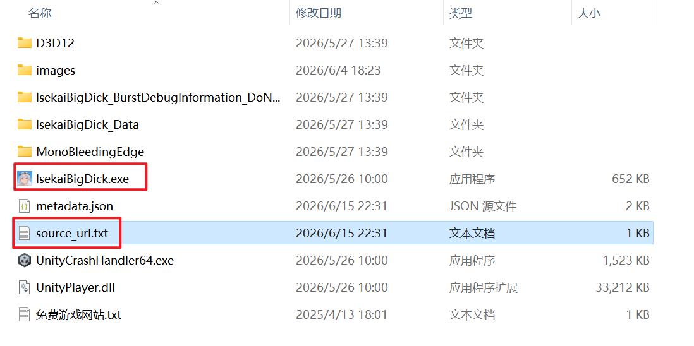
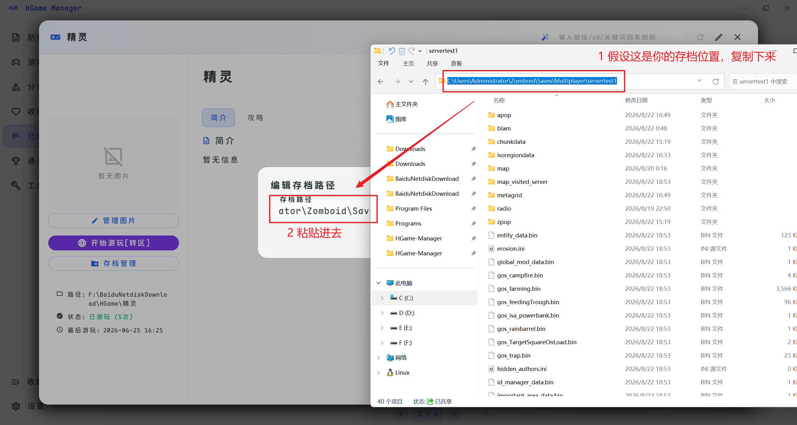
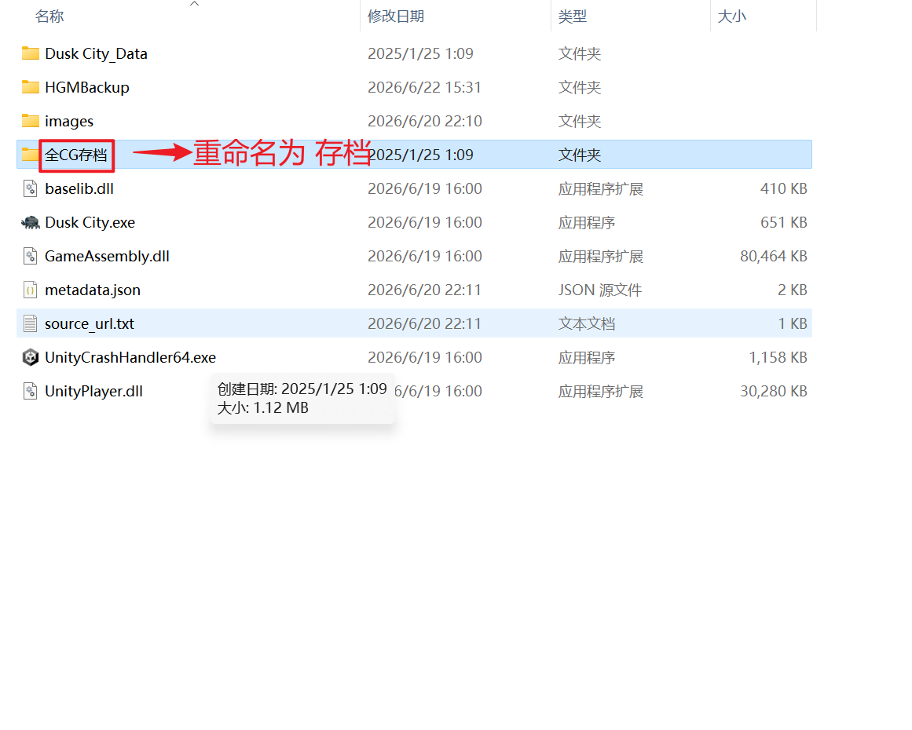
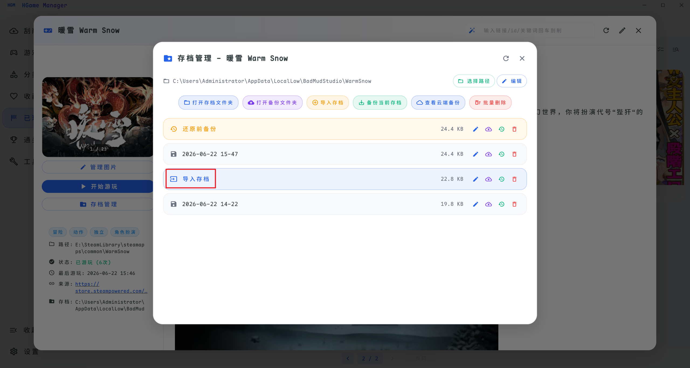
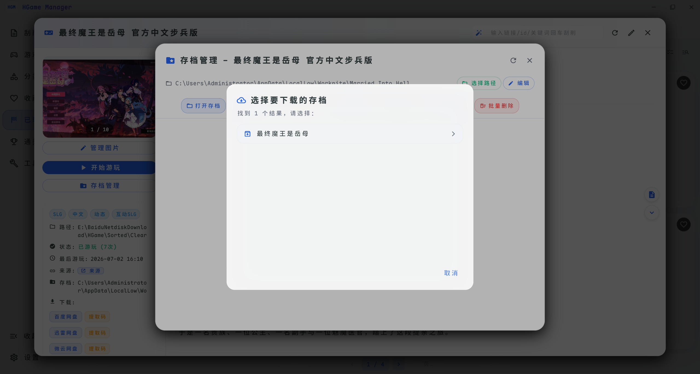

# 存档管理

要使用存档扫描功能，需要先**标记游戏为「已玩」状态**（右键菜单的「添加游玩次数」或游戏详情页的「开始游玩」），并且本地确实有玩过该游戏。

## 扫描存档位置

1. 切换到「已玩」页面
2. 点击右上角的「扫描存档位置」按钮

3. 扫描完成后，进入游戏详情页会出现「存档」按钮

::: warning 注意
`source_url.txt` 必须和游戏启动文件（.exe）放在同一目录或者放在HGMDatas文件夹下，软件通过 exe 文件名来匹配游戏。存档扫描不保证 100% 成功，如果失败可以**手动填写存档路径**，之后也能通过软件快速打开存档位置。
:::

4. 如果扫描失败，手动填写存档路径(非必须)

## 自动导入存档

当你有一些全CG/全图鉴存档时，将你想要导入的存档放在游戏的根目录下，并重命名为「**存档**」两个字，这样软件会自动识别并导入：

回到软件点击「存档管理」，可以看到自动导入的「导入存档」，并且能够进行「备份」「恢复」「上传至云端」（上传至云端必须在设置中填写 WebDAV）等一系列操作：

## 下载全CG/全图鉴存档

在存档管理页面可以从2DFan进行搜索存档，如果有返回可以快速下载到本地进行替换等操作

