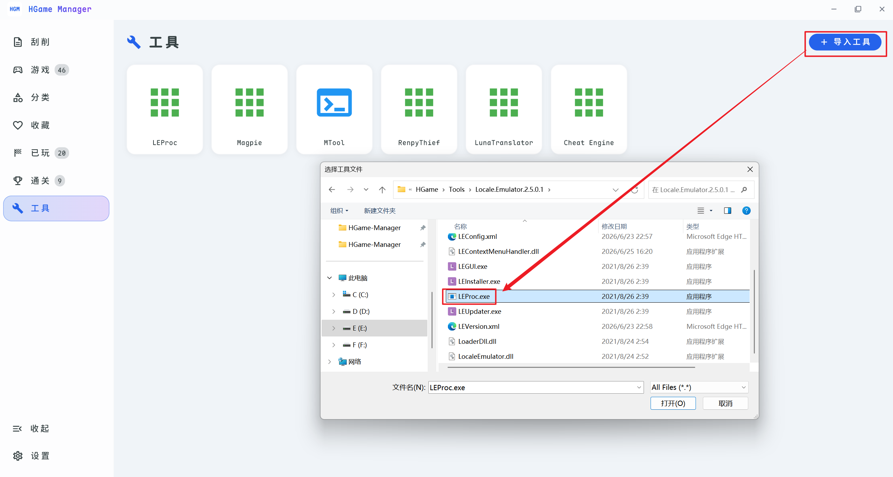
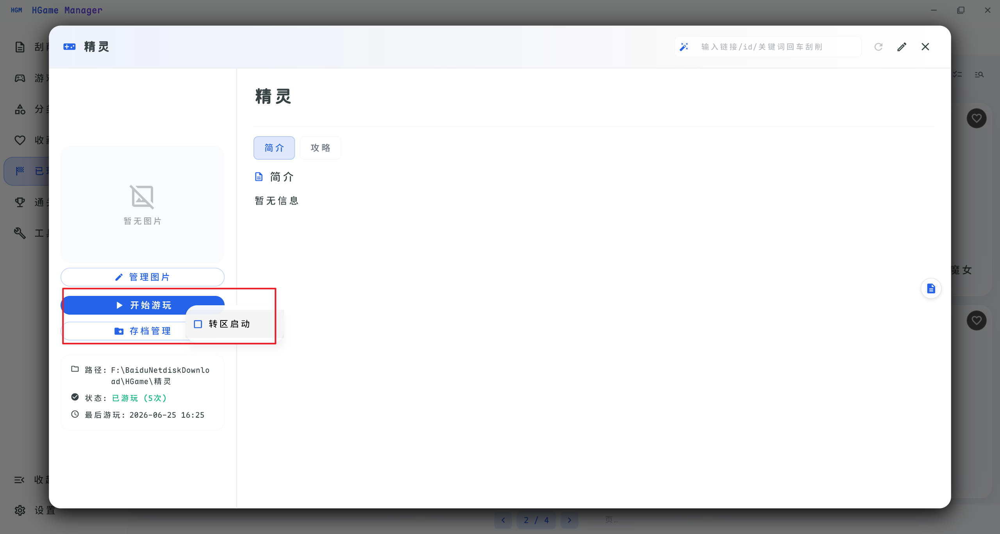

# 工具与转区启动

## 导入工具

软件支持导入各种常用游玩过程中需要的工具以便快速启动。

「工具」页面 → 点击「导入」→ 选择工具的真实启动程序。

::: tip
例如 MTool 是用 bat 启动的，那就选择 bat 文件，并不是非要 exe 文件。
:::

## 转区启动

1. 导入 [**LEProc.exe**](https://github.com/xupefei/Locale-Emulator/releases)（Locale-Emulator）

    

2. 打开需要转曲启动的游戏详情页，右键「开始游玩」并勾选 「转区启动」，后续该软件无需再次点击会默认转区启动

    
