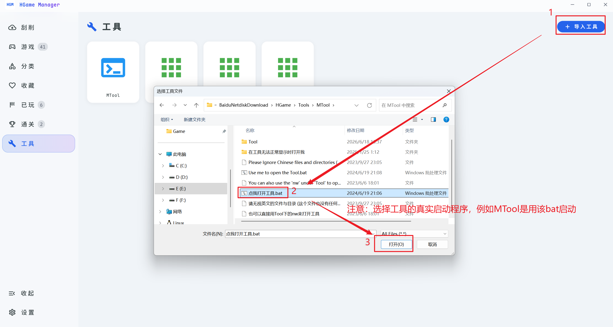

# 工具与转区启动

## 导入工具

「工具」页面 → 点击「导入」→ 选择工具的真实启动程序。

::: tip
例如 MTool 是用 bat 启动的，那就选择 bat 文件，并不是非要 exe 文件。
:::

## 转区启动

导入 [LEProc.exe](https://github.com/xupefei/Locale-Emulator/releases)（Locale-Emulator）后，可以联动**转区启动**游戏，解决日文游戏乱码问题。
