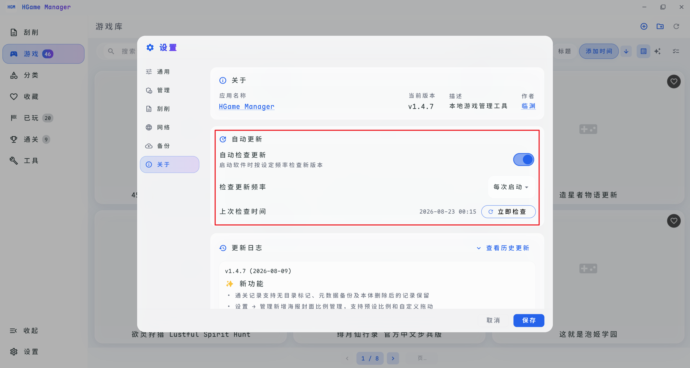

# 软件更新

## 方式一：自动更新

打开软件的「设置」页面，点击「关于」选项卡，可以自行设置是否自动检查更新以及频率，有新版本则会弹出更新提示框。

::: tip
即使不设置自动检查更新，也能够点击「立即检查」按钮进行手动检查更新
:::

## 方式二：手动更新

解压「新版本」后，全选复制到「旧版本」文件夹中**替换**即可。

::: tip
软件的数据（游戏库、配置等）存储在 exe 同级的 `hgame_manager_data` 目录中，正常替换 exe 文件不会丢失数据。但建议更新前先备份数据目录以防万一。
:::
