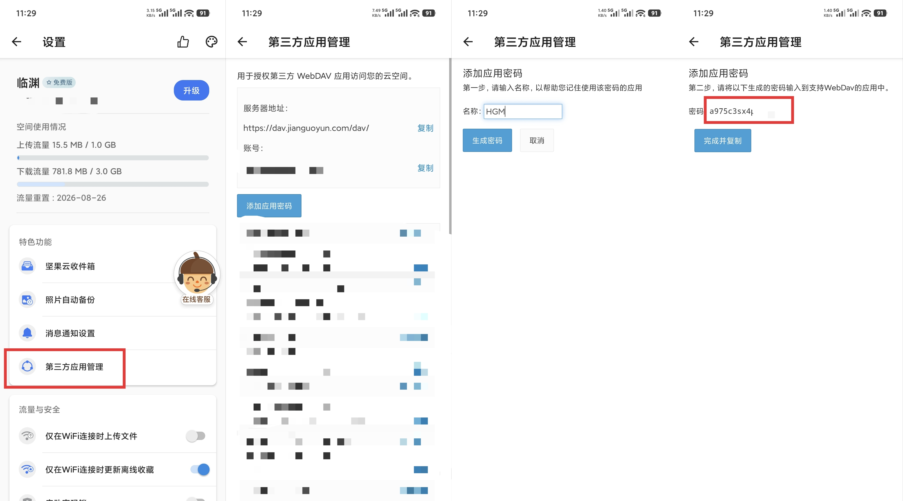
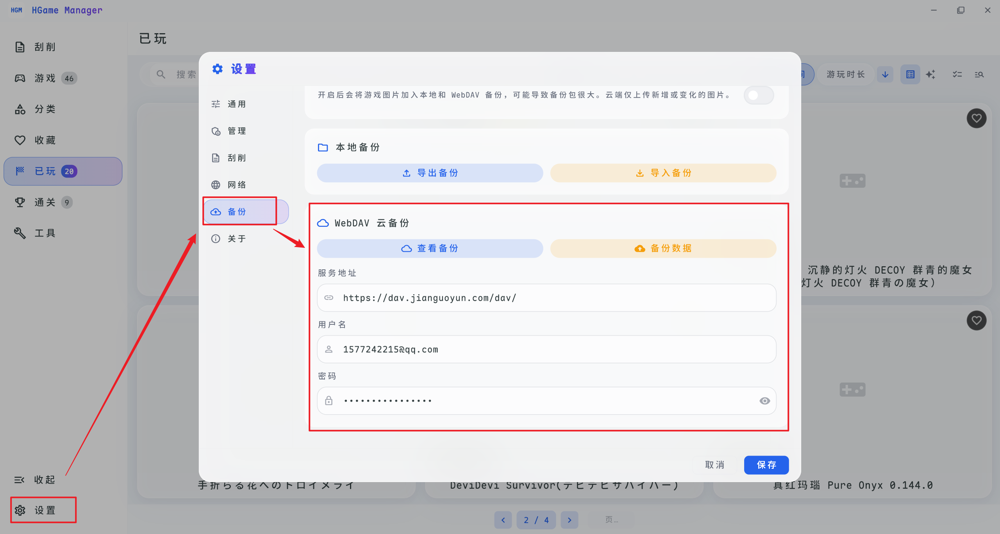

# WebDAV

当你需要访问一个 WebDAV 服务器进行云端操作时，你可以使用 WebDAV 协议，在这里推荐使用[坚果云](https://www.jianguoyun.com/) (免费版提供 1GB 上传流量 / 月)，接下来的教程以坚果云为例，其余支持 WebDAV 的服务也类似。

## 获取 WebDAV 信息

1. 打开坚果云APP并登录账号
2. 打开设置页面
3. 点击「第三方应用管理」
4. 点击「添加应用密码」
5. 填写应用名称（自定义即可），并点击「生成密码」
6. 复制生成的密码

## 填写 WebDAV 信息

打开软件的「设置」页面，点击「备份」选项卡，将上一步获取到的WebDAV信息填写到输入框中（服务地址固定为: https://dav.jianguoyun.com/dav/ ）。

